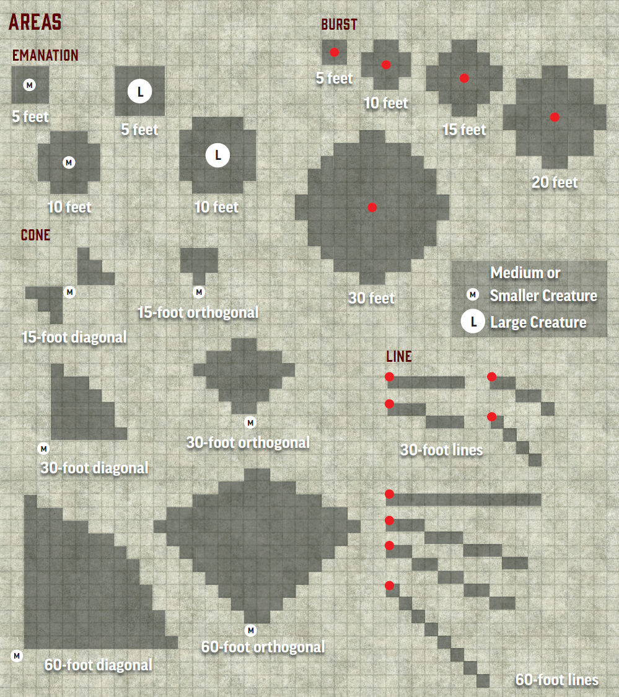

__Source__ Player Core pg. 300

Spells with a range can affect targets, create areas, or make things appear only within that range. Most spell ranges are measured in feet, though some can stretch over miles, reach anywhere on the planet, or go even farther!

## Other Spell Traits

Below is a glossary of a few traits you might see with important rules.

### Darkness And Light

Non-magical light always shines in non-magical darkness and always fails to shine in magical darkness. Magical light always shines in non-magical darkness but shines in magical darkness only if the light spell has a higher rank than that of the darkness effect. Spells with the darkness trait or the light trait can always counteract one another, but bringing light and darkness into contact doesn't automatically do so. You must usually cast a light spell on a darkness effect directly to counteract it (and vice versa), but some spells automatically attempt to counteract opposing effects.

### Minion

Minions are creatures that directly serve another creature. Your minion acts on your turn in combat, once per turn, when you spend an action to issue it commands. For an animal companion, you Command an Animal; for a minion that's a spell or magic item effect, like a summoned minion, you Sustain the effect (page 419); if not otherwise specified, you issue a verbal command as a single action with the auditory and concentrate traits. If given no commands, minions use no actions except to defend themselves or to escape obvious harm. If left unattended for long enough, typically 1 minute, mindless minions usually don't act, animals follow their instincts, and sapient minions act how they please.

A minion has only 2 actions and 0 reactions per turn, though certain conditions (such as slowed or quickened) or abilities might give them a reaction that they can use. Alterations to a minion's actions occur when they gain their actions for the round. A minion can't control other creatures.

### Summoned

A creature called by a spell or effect gains the summoned trait. A summoned creature can't summon other creatures, create things of value, or cast spells that require a cost. It has the minion trait. If it tries to cast a spell of equal or higher rank than the spell that summoned it, it overpowers the summoning magic, causing its own spell to fail and the summon spell to end. Otherwise, the summoned creature uses the standard abilities for a creature of its kind. It generally attacks your enemies to the best of its ability. If you can communicate with it, you can attempt to command it, but the GM determines the degree to which it follows your commands.

Immediately when you finish casting, the summoned creature uses its 2 actions for that turn. A spawn or other creature generated from a summoned creature returns to its unaltered state (usually a corpse in the case of spawn) once the summoned creature is gone. If it's unclear what this state would be, the GM decides. Summoned creatures can be banished by various spells and effects. They are automatically banished if reduced to 0 Hit Points or if the spell that called them ends.

### Morph

Spells that slightly alter a creature's form have the morph trait. Any Strikes specifically granted by a magical morph effect also gain the magical trait. You can be affected by multiple morph spells at once, but if you morph the same body part more than once, the second morph effect attempts to counteract the first (in the same manner as two polymorph effects, described below). Your morph effects might also end if you are polymorphed and the polymorph effect invalidates or overrides your morph effect. For instance, a morph that gave you wings would be dismissed if you polymorphed into a form that had wings of its own (though if your new form lacked wings, you'd keep the wings from your morph). The GM determines which morph effects can be used together and which can't.

### Polymorph

These effects completely transform the target into a new form. A target can't be under the effect of more than one polymorph at a time. If it comes under the effect of another, the second effect attempts to counteract the first. If it succeeds, it takes effect, and if it fails, the spell has no effect on that target. Any Strikes granted by a polymorph effect are magical. Unless otherwise stated, polymorph spells don't allow the target to take on the appearance of a specific individual creature, but rather just a generic creature of a general type or ancestry.

If you take on a battle form with a polymorph spell, the special statistics can be adjusted only by circumstance bonuses, status bonuses, and penalties. Unless otherwise noted, the battle form prevents you from casting spells, speaking, and using most manipulate actions that require hands. (If there's doubt about whether you can use an action, the GM decides.) Your gear is absorbed into you; the constant abilities of your gear still function, but you can't activate any items. If a polymorph effect causes you to increase in size, you must have space to expand into or the effect is disrupted.

### Illusions

Magic with the illusion trait creates false sensory stimuli. Sometimes illusions allow creatures a chance to disbelieve the spell, which lets the creature ignore the spell if it succeeds at doing so. This usually happens when a creature Seeks, Interacts, or otherwise spends actions to engage with the illusion, comparing the result of its Perception check (or another check or save the GM chooses) to the caster's spell DC. Mental illusions typically provide rules in the spell's description for disbelieving the effect (usually via a Will save).

If a creature engages with an illusion in a way that would prove it's not what it seems, the creature might know that an illusion is present, but it still can't ignore the illusion without successfully disbelieving it. Disbelieving a visual illusion makes it and those things it blocks seem hazy and indistinct, which might block vision enough to leave the other side concealed

## Subtle Spells

A spell with the subtle trait can be cast without incantations and doesn’t have obvious manifestations. Most of these spells enhance your subterfuge or stealth, such as invisibility. Some abilities, like the Conceal Spell feat (page 201), allow you to make spells subtle even if they wouldn’t normally be.

## Spellshape

Many spellcasters can gain access to spellshape actions, typically by selecting spellshape feats. Spellshape actions tweak the properties of your spells. You must use a spellshape action directly before casting the spell you want to alter. If you use any action (including free actions and reactions) other than casting a spell directly after, you waste the benefits of the spellshape action. The benefit is also lost if your turn ends before you cast the spell. Any additional effects added by a spellshape action are part of the spell’s effect, not of the spellshape action itself.

## Touch Range

__Source__ Player Core pg. 300

A spell with a touch range requires you to physically touch the target. You use your unarmed reach to determine whether you can touch the creature. You can usually touch them automatically, though the spell might specify that they can attempt a saving throw or that you must attempt a spell attack roll. If an ability increases the range of a touch spell, start at 0 feet and increase from there.

## Areas

__Source__ Player Core pg. 300

Sometimes a spell has an area, which can be a burst, cone, emanation, or line (pages 428–429). If the spell originates from your position, the spell has only an area; if you can cause the spell’s area to appear farther away from you, the spell has both a range and an area.

## Targets

__Source__ Player Core pg. 300

Some spells allow you to target a creature, an object, or something more specific. The target must be within the spell's range, and you must be able to see it (or otherwise perceive it with a precise sense) to target it. At the GM's discretion, you can attempt to target a creature you can't see, as described in Detecting Creatures on page 434. If you fail to target a particular creature, this doesn't change how the spell affects any other targets the spell has.

If you choose a target that isn't valid, such as if you thought a vampire was a living creature and targeted it with a spell that can target only living creatures, your spell fails to target that creature. If a creature starts out as a valid target but ceases to be one during a spell's duration, the spell typically ends, but the GM might decide otherwise in certain situations. Some spells restrict you to willing targets. A player can declare their character a willing or unwilling target at any time, regardless of turn order or their character's condition (such as when a character is paralyzed, unconscious, or even dead).

Spells that affect multiple creatures in an area can have both an Area entry and a Targets entry. A spell that has an area but no targets listed usually affects all creatures in the area indiscriminately.

## Line of Effect

__Source__ Player Core pg. 302

You usually need an unobstructed path to the target of a spell, the origin point of an area, or the place where you create something with a spell. More information on line of effect can be found on page 426.
